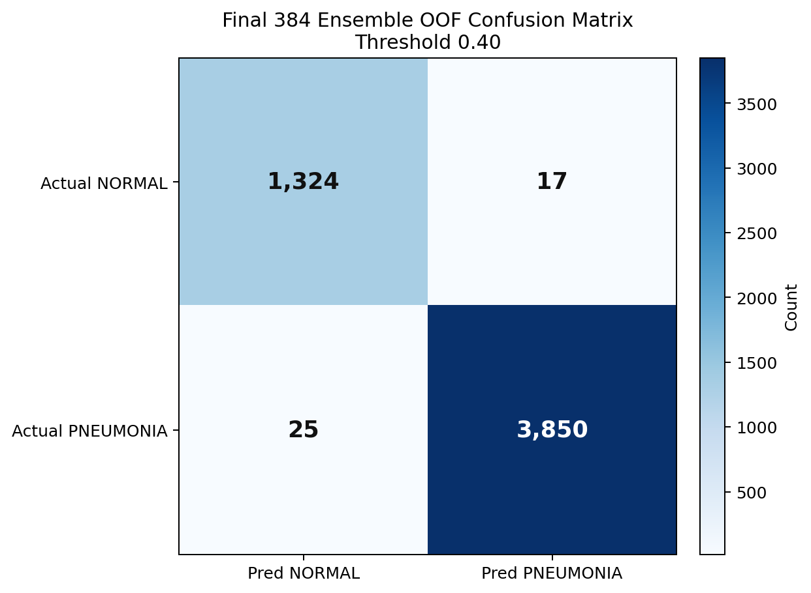
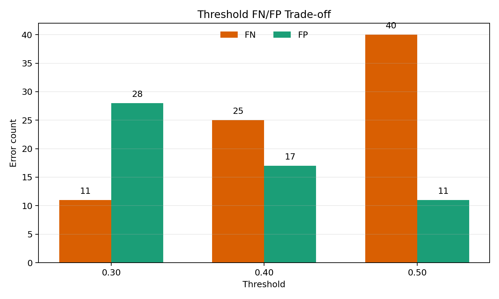

# 흉부 X-ray NORMAL/PNEUMONIA 분류

**한국어** | [English](README.en.md)

> **개인 프로젝트 · Medical AI Portfolio**

오즈코딩스쿨에서 제공받은 교육용 흉부 X-ray 데이터로 진행한 개인 의료 AI
프로젝트입니다. 데이터 감사와 중복 그룹 분할부터 Custom CNN 기준 모델,
전이학습, 384px 5-fold 앙상블, FN/FP 및 Grad-CAM 오류 분석까지 직접
구성했습니다. Accuracy만 높이는 대신 PNEUMONIA 민감도(Sensitivity),
특이도(Specificity), 임계값(Threshold)에 따른 오류 교환과 데이터 누수 위험을
함께 검증했습니다.

`Medical AI` · `PyTorch` · `Transfer Learning` · `5-Fold OOF` ·
`Grad-CAM` · `Error Analysis`

> 이 저장소는 연구·교육 목적의 포트폴리오입니다. 임상 진단 시스템,
> 의료기기 또는 의료 전문가의 판단을 대체하는 도구가 아닙니다.

## 핵심 성과

- 5,216장의 학습 데이터를 감사하고 중복 증거를 그룹화해
  train/validation 간 파일 및 strict duplicate-group overlap을 0건으로
  확인했습니다.
- Custom CNN 기준 모델을 먼저 구축한 뒤 frozen/fine-tuned 전이학습과
  384px 3-backbone 앙상블을 순차적으로 비교했습니다.
- 5-fold OOF 5,216장, threshold 0.40에서 Accuracy `0.9919`,
  Sensitivity `0.9935`, Specificity `0.9873`, F1 `0.9946`,
  AUROC `0.9995`를 기록했습니다.
- threshold 0.30/0.40/0.50의 FN/FP 변화를 비교하고, Grad-CAM에서
  border·marker 같은 shortcut feature 의존 가능성을 확인했습니다.

## 프로젝트 한눈에 보기

| 항목 | 내용 |
| --- | --- |
| 프로젝트 유형 | 개인 프로젝트 · 교육용 의료 영상 이진 분류 포트폴리오 |
| 문제 | 흉부 X-ray를 `NORMAL`과 `PNEUMONIA`로 분류 |
| 개인 수행 범위 | 데이터 감사, 중복 그룹 분할, PyTorch 모델링, 학습·평가, OOF 앙상블, threshold 분석, FN/FP·Grad-CAM 검토, 문서화 |
| 데이터 | 오즈코딩스쿨 제공 교육용 데이터: labeled train 5,216장, unlabeled test 624장 |
| 검증 | strict duplicate-aware holdout 및 5-fold OOF |
| 기준 결과 | 384px ensemble OOF, threshold 0.40: F1 `0.9946`, Sensitivity `0.9935`, Specificity `0.9873` |
| 차별점 | Accuracy 단일 지표가 아니라 누수 위험, FN/FP 비용, threshold 정책, shortcut risk를 함께 검증 |

## 1. 문제 정의와 평가 원칙

이 프로젝트에서 `PNEUMONIA`를 양성 클래스(`1`)로 정의했습니다.

- **FN (False Negative)**: 실제 PNEUMONIA를 NORMAL로 예측
- **FP (False Positive)**: 실제 NORMAL을 PNEUMONIA로 예측
- **Sensitivity**: PNEUMONIA recall
- **Specificity**: NORMAL recall

의료 영상 분류에서는 높은 Accuracy만으로 오류의 성격을 알 수 없습니다.
따라서 confusion matrix, precision, recall, F1, AUROC, sensitivity,
specificity와 FN/FP를 함께 기록했습니다. Threshold는 고정된 정답이 아니라
FN과 FP의 비용을 조절하는 **운영 지점(operating point)**으로 해석했습니다.

## 2. 데이터와 누수 위험

### 데이터 구성

| 구분 | NORMAL | PNEUMONIA | 전체 |
| --- | ---: | ---: | ---: |
| Labeled train 전체 | 1,341 | 3,875 | 5,216 |
| Strict train | 1,073 | 3,100 | 4,173 |
| Strict validation | 268 | 775 | 1,043 |
| Unlabeled test | - | - | 624 |

데이터는 오즈코딩스쿨 의료 AI 교육 과정에서 제공받았습니다. 원본 의료 영상의
상위 배포처, 불변 버전, 환자 동의·비식별화 문서와 재배포 라이선스는 확인되지
않았습니다. 따라서 X-ray 원본은 Git에 포함하지 않았으며, 공개 데이터셋과의
동일성을 이미지 수나 클래스명만으로 추정하지 않습니다. 자세한 경계는
[`DATASET.md`](DATASET.md)에 기록했습니다.

### Duplicate-aware split

초기 감사에서 exact hash와 perceptual hash 기반 중복 가능성을 확인했습니다.
중복 연결 관계를 그룹으로 구성하고 `StratifiedGroupKFold` 후보 중 클래스
비율을 유지하는 split을 선택했습니다. 이후 지나치게 큰 perceptual cluster가
validation을 왜곡할 수 있어 exact duplicate 연결은 유지하면서 큰
perceptual group을 재검토하는 strict split을 만들었습니다.

- train/validation 파일 overlap: `0`
- strict duplicate-group overlap: `0`
- 모든 5,216장 할당: 확인
- 남은 한계: patient ID가 없어 환자 단위 누수를 배제할 수 없음

근거:
[duplicate-aware split 보고서](reports/duplicate_aware_split_report.md),
[strict split 보고서](reports/strict_duplicate_split_report.md),
[추적 가능한 split CSV](data/splits/README.md)

## 3. 개인 수행 범위와 핵심 의사결정

개인 프로젝트로 진행하며 데이터 구조와 중복 위험 감사, split 설계,
Custom CNN 및 전이학습 모델 구현, 학습·평가 루프, checkpoint와 지표 저장,
OOF 앙상블, threshold 분석, FN/FP 추출, Grad-CAM 검토와 결과 문서화를
수행했습니다.

### 3.1 기준 모델부터 시작

전이학습 모델을 바로 적용하지 않고 Custom CNN을 먼저 학습해 데이터 파이프라인,
지표 계산, checkpoint 저장과 FN/FP 추출을 검증했습니다. 이후 동일한 validation
split에서 DenseNet121, ResNet50, EfficientNet-B0 등의 frozen/fine-tuned
설정을 비교했습니다.

### 3.2 한 번에 하나의 실험 요인 변경

실험은 다음 순서로 확장했습니다.

```text
데이터 감사
→ duplicate-aware / strict split
→ Custom CNN baseline
→ 전이학습 frozen vs fine-tune
→ 384px 3-backbone 5-fold OOF
→ ensemble + threshold 분석
→ pseudo-labeling 검토
→ FN/FP 및 Grad-CAM 오류 분석
```

최종 앙상블은 `DenseNet121-CBAM + EfficientNet-B3 + ConvNeXt-Tiny`로
구성했습니다. 모델 확률 상관계수는 OOF 기준 `0.988~0.991`로 높았지만,
오류 집합의 Jaccard overlap은 약 `0.305~0.338`이었습니다. 따라서 앙상블
효과를 “서로 독립적인 모델”로 과장하지 않고, 완전히 같지 않은 오류 패턴을
평균화해 FN/FP 균형을 안정화한 결과로 해석했습니다.

### 3.3 FN 중심 threshold 선택

threshold를 낮추면 PNEUMONIA를 놓치는 FN은 감소하지만 NORMAL을
PNEUMONIA로 판단하는 FP가 증가합니다. 최종 보고 기준 `0.40`은 가장 높은
Accuracy만 선택한 값이 아니라 Sensitivity와 Specificity의 균형을 설명하기
위한 운영 지점입니다.

### 3.4 Grad-CAM을 오류 분석에 사용

Grad-CAM은 모델이 민감하게 반응한 위치를 확인하는 보조 도구로만 사용했으며,
병변 위치의 정답으로 해석하지 않았습니다. Correct PNEUMONIA, FN, FP 사례를
나누어 모델이 폐 영역뿐 아니라 상단 marker, 어깨, crop border, 측면 edge에도
반복적으로 반응하는지 검토했습니다.

## 4. 검증 결과

### 모델 단계별 결과

| 단계 | 평가 조건 | Threshold | Accuracy | Sensitivity | Specificity | F1 | AUROC | FN | FP |
| --- | --- | ---: | ---: | ---: | ---: | ---: | ---: | ---: | ---: |
| Custom CNN best checkpoint | 1,043장 holdout validation | 0.50 | 0.9770 | 0.9884 | 0.9440 | 0.9846 | 0.9960 | 9 | 15 |
| DenseNet121 fine-tune | 동일 1,043장 validation | 0.50 | 0.9760 | 0.9806 | 0.9627 | 0.9838 | 0.9962 | 15 | 10 |
| 384px final ensemble | 5-fold OOF 5,216장 | 0.40 | 0.9919 | 0.9935 | 0.9873 | 0.9946 | 0.9995 | 25 | 17 |

> Custom CNN과 DenseNet121은 단일 holdout validation, final ensemble은
> 전체 5,216장의 5-fold OOF 결과입니다. 평가 protocol이 다르므로 이 표를
> 엄격한 동일 조건 모델 순위로 해석할 수 없습니다.

수치 근거:
[Custom CNN metrics](reports/artifacts/baseline/best_metrics.json),
[전이학습 비교](reports/artifacts/transfer_learning/comparison.csv),
[OOF threshold 결과](reports/artifacts/ensemble_384/threshold_tradeoff.csv)

### Final ensemble confusion matrix



*5-fold OOF 5,216장, threshold 0.40. NORMAL 1,341장 중 FP 17건,
PNEUMONIA 3,875장 중 FN 25건입니다.*

### Threshold에 따른 오류 교환

| Threshold | Accuracy | Sensitivity | Specificity | F1 | FN | FP |
| ---: | ---: | ---: | ---: | ---: | ---: | ---: |
| 0.30 | 0.9925 | 0.9972 | 0.9791 | 0.9950 | 11 | 28 |
| 0.40 | 0.9919 | 0.9935 | 0.9873 | 0.9946 | 25 | 17 |
| 0.50 | 0.9902 | 0.9897 | 0.9918 | 0.9934 | 40 | 11 |



*Threshold가 높아질수록 FP는 줄지만 FN이 증가했습니다. 실제 임상 운영
threshold를 제안한 결과가 아니라 내부 OOF 오류 비용을 비교한 결과입니다.*

## 5. 오류 분석과 실패에서 얻은 판단

### Pseudo-labeling은 성능 향상으로 주장하지 않음

고신뢰 test 예측 63장(NORMAL 57, PNEUMONIA 6)을 사용한 fine-tuning 후
예측 확률 분포가 더 극단적으로 변했습니다. 그러나 test label이 없어 이것이
성능 향상인지 overconfidence인지 구분할 수 없습니다. 따라서 pseudo-labeling은
“개선 완료”가 아니라 외부 label 또는 leaderboard 검증이 필요한 실험으로
남겼습니다.

### Grad-CAM에서 shortcut risk 확인

27개 correct/FN/FP Grad-CAM을 검토한 결과 폐 하부와 흉곽 내부에 반응한
사례도 있었지만, marker·텍스트·border 같은 비폐 영역의 강한 activation도
반복됐습니다. 이는 모델이 항상 의학적으로 타당한 특징만 사용한다고 단정할
수 없다는 근거이며, 후속 실험으로 lung crop, border masking, marker
masking을 분리 검증해야 합니다.

### 남은 검증 한계

- patient ID 부재로 patient-level leakage를 완전히 배제할 수 없습니다.
- labeled validation/OOF가 같은 데이터 계열이므로 외부 일반화를 입증하지
  못합니다.
- unlabeled test 때문에 pseudo-labeling 전후 성능을 직접 비교할 수 없습니다.
- 높은 내부 지표는 임상 유효성이나 진단 성능을 입증하지 않습니다.
- 데이터 원본의 상위 출처와 재배포 라이선스가 확인되지 않았습니다.

## 6. 기술 스택

- **Modeling:** PyTorch, torchvision, Custom CNN, DenseNet, EfficientNet,
  ConvNeXt, CBAM
- **Data:** pandas, NumPy, Pillow, OpenCV, Albumentations
- **Validation:** scikit-learn, StratifiedGroupKFold, OOF prediction,
  confusion matrix, AUROC
- **Explainability:** Grad-CAM
- **Environment:** local macOS, Kaggle GPU, Google Colab

## 7. 실행과 재현

### 환경 구성

```bash
python -m venv .venv
source .venv/bin/activate
python -m pip install --upgrade pip
python -m pip install -r requirements.txt
```

### 데이터 구조

```text
data/
├── train.csv
├── test.csv
├── sample_submission.csv
├── splits/
└── images/
    ├── train/
    └── test/
```

이미지는 저장소에 포함되지 않습니다. 권한이 있는 경로에서 데이터를 받은 뒤
[`DATASET.md`](DATASET.md)의 제한을 확인해야 합니다.

### 기본 검증

```bash
python -m src.data.audit
python -m src.data.duplicate_aware_split
python scripts/smoke/check_dataloader_forward.py
python scripts/smoke/check_custom_cnn_training.py
```

역할별 실행 파일은 [scripts 가이드](scripts/README.md), Kaggle 진입점은
[Kaggle 가이드](kaggle/README.md), 통합 제출 노트북은
[notebook 가이드](notebooks/README.md)를 참고할 수 있습니다.

## 8. 주요 결과물

- [최종 앙상블·pseudo-labeling 보고서](reports/final_ensemble_pseudo_labeling_report.md)
- [Custom CNN baseline 보고서](reports/mission1_baseline_report.md)
- [실험 로그](docs/EXPERIMENT_LOG.md)
- [검토 가능한 핵심 산출물](reports/artifacts/README.md)
- [재현 가능한 split](data/splits/README.md)
- [프로젝트 상태](PROJECT_STATUS.md)
- [로드맵](ROADMAP.md)

체크포인트, submission, 원본 X-ray 및 X-ray가 포함된 Grad-CAM contact sheet와
최종 PDF는 로컬 `outputs/` 또는 제외 경로에 보관하며 Git에 게시하지 않습니다.

## 9. 데이터 및 라이선스

- 데이터 제공 경로와 공개 제한: [`DATASET.md`](DATASET.md)
- 코드 라이선스: 아직 선택되지 않음
- 라이선스가 추가되기 전에는 코드 재사용·재배포 권한이 자동으로 부여되지
  않습니다.

## 10. 면접용 30초 설명

> 흉부 X-ray의 NORMAL/PNEUMONIA 이진 분류 프로젝트에서 데이터 감사부터
> PyTorch 모델 구현, 5-fold OOF 앙상블과 오류 분석까지 수행했습니다.
> 중복 이미지가 validation에 함께 들어갈 위험을 줄이기 위해
> duplicate-aware strict split을 만들고 overlap 0건을 확인했습니다.
> 최종 384px 앙상블은 OOF threshold 0.40에서 Sensitivity 0.9935,
> Specificity 0.9873을 기록했지만, 이를 임상 성능으로 과장하지 않았습니다.
> Threshold별 FN/FP 교환과 Grad-CAM의 border·marker 반응을 분석해 높은
> 점수뿐 아니라 모델이 어디서 실패하고 무엇을 추가 검증해야 하는지까지
> 설명한 프로젝트입니다.
