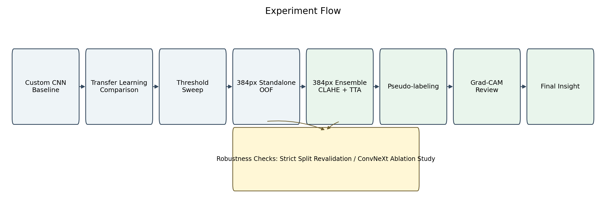
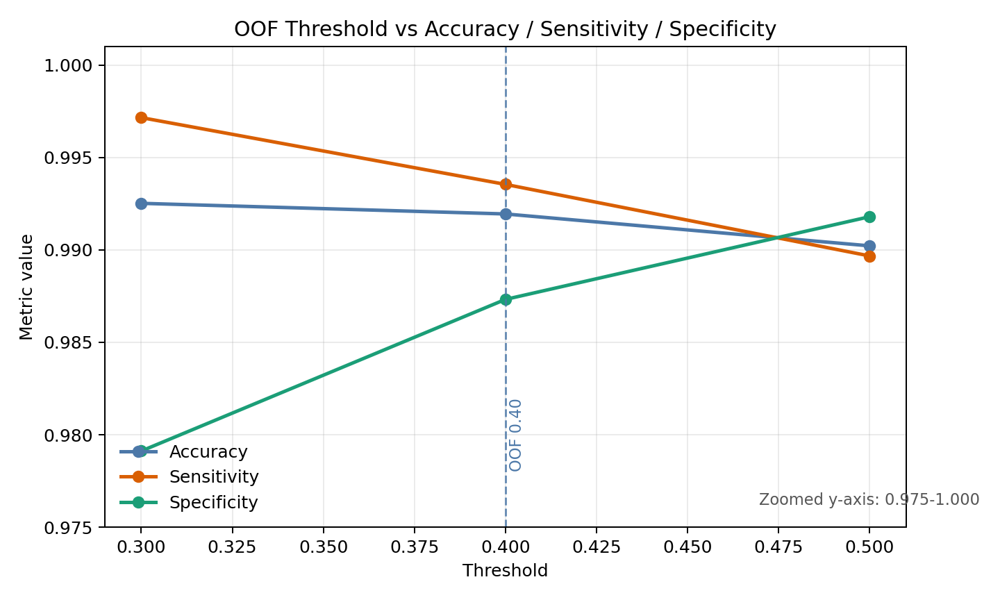
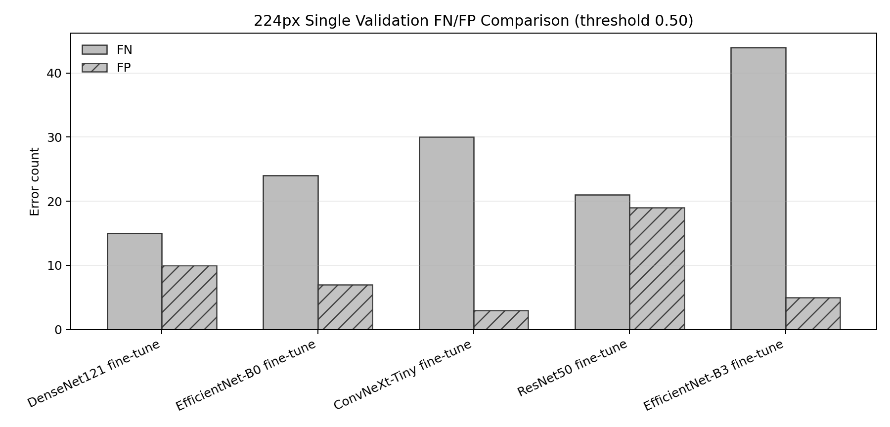
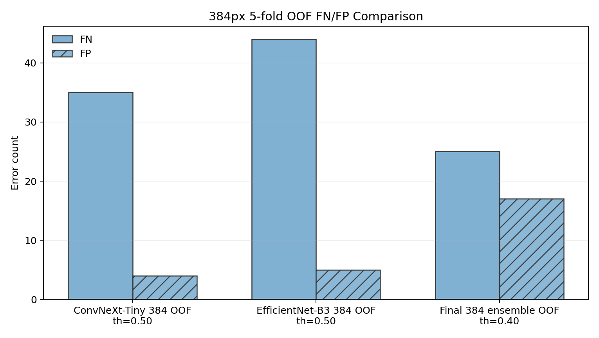
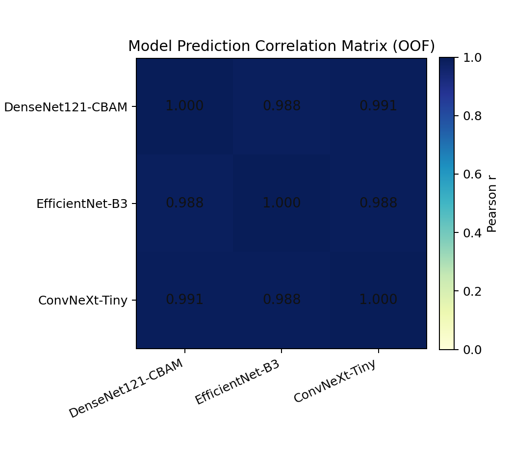
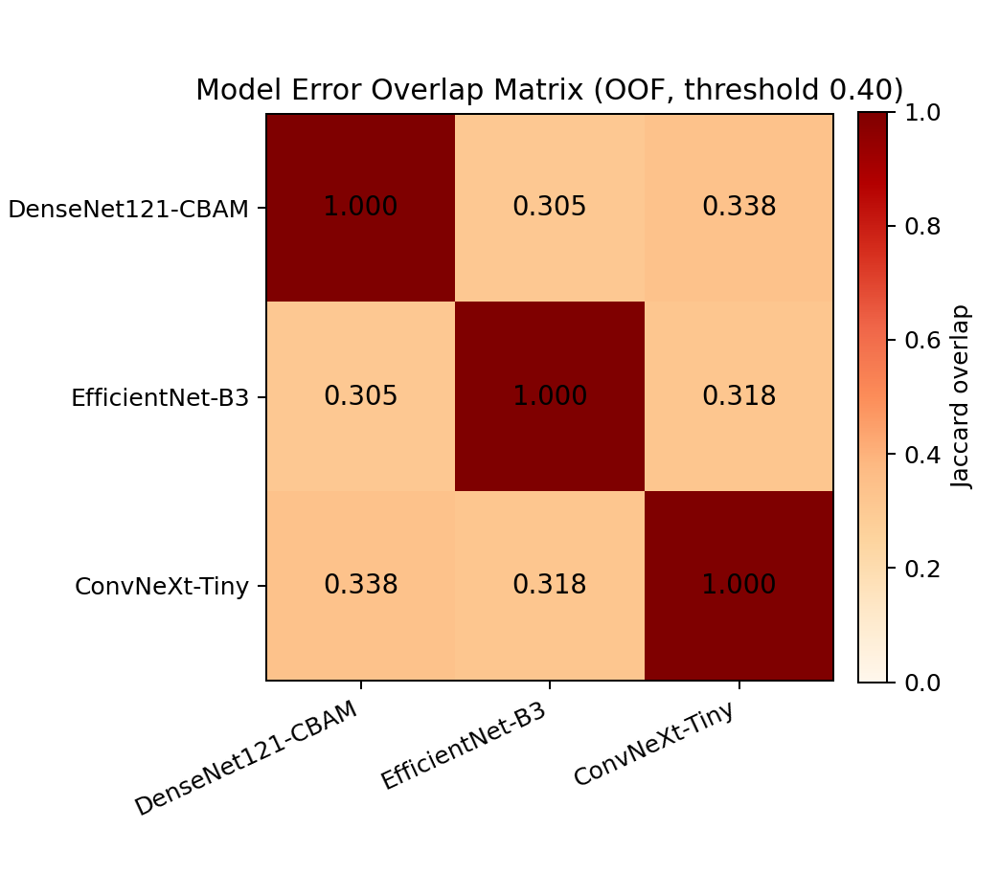
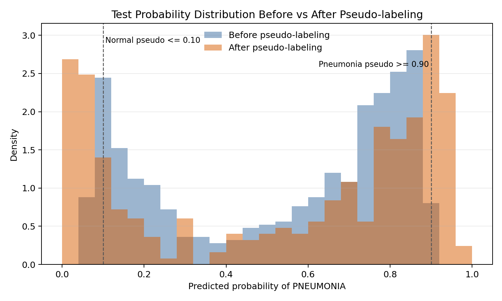

# Final Ensemble + Pseudo-Labeling Report

이 보고서는 흉부 X-ray 이미지를 `NORMAL`과 `PNEUMONIA`로 분류하는 연구/교육 목적의 포트폴리오 실험 결과를 정리한 문서이다. 본 프로젝트는 모델 성능 개선과 해석 가능성 분석을 목표로 하며, 실제 임상 진단 시스템 또는 의료기기로 해석하면 안 된다.

## 1. 실험 목적

초기 Custom CNN baseline 이후, 전이학습 기반 모델과 앙상블 전략을 적용하여 PNEUMONIA 분류 성능을 개선하는 것이 목표였다. 특히 이진 분류에서 단순 Accuracy만 보지 않고, PNEUMONIA recall/sensitivity, NORMAL specificity, F1-score, AUROC, confusion matrix, FN/FP를 함께 확인했다.

의료영상 분류에서는 실제 PNEUMONIA를 NORMAL로 예측하는 False Negative가 가장 위험한 오류이므로, 최종 판단에서는 FN 수와 PNEUMONIA recall을 별도로 확인했다.

## 2. 개선 전략

### 전략 1. 384x384 고해상도 입력 + CLAHE 전처리

Baseline Custom CNN은 224x224 입력을 사용했지만, 최종 파이프라인에서는 입력 해상도를 384x384로 높였다. 흉부 X-ray의 폐 음영, 혈관 음영, 국소적인 opacity 같은 미세한 패턴은 낮은 해상도에서 손실될 수 있으므로, 더 큰 입력 크기를 사용해 세부 texture 정보를 보존하려고 했다.

또한 CLAHE(Contrast Limited Adaptive Histogram Equalization)를 적용했다. X-ray 이미지는 촬영 조건, 밝기, contrast 차이가 크기 때문에 CLAHE를 통해 국소 contrast를 보정하고, 폐 영역 내부의 밝기 차이를 모델이 더 안정적으로 학습하도록 했다.

선택 이유:

- X-ray는 grayscale 기반 영상이므로 contrast 차이가 모델 판단에 큰 영향을 줄 수 있다.
- 384x384 입력은 224x224보다 폐 영역의 국소 패턴을 더 많이 보존할 수 있다.
- CLAHE는 전체 밝기를 단순히 키우는 방식이 아니라 국소 contrast를 보정하므로 의료영상 전처리에 비교적 적합하다.

### 전략 2. DenseNet121-CBAM + EfficientNet-B3 + ConvNeXt-Tiny 앙상블

최종 파이프라인은 서로 다른 구조의 전이학습 모델을 함께 사용했다.

- DenseNet121 + CBAM
- EfficientNet-B3
- ConvNeXt-Tiny

DenseNet121은 feature reuse가 강한 구조로 X-ray처럼 subtle feature가 중요한 데이터에 적합하다고 판단했다. DenseNet121에는 CBAM attention module을 추가해 channel/spatial attention을 적용했다. EfficientNet-B3는 compound scaling 기반 구조로 성능과 효율의 균형이 좋고, ConvNeXt-Tiny는 modern CNN 구조로 다른 모델과 다른 inductive bias를 제공한다.

선택 이유:

- 단일 모델보다 서로 다른 구조의 모델을 결합하면 prediction variance를 줄일 수 있다.
- DenseNet, EfficientNet, ConvNeXt는 feature 추출 방식이 달라 앙상블 다양성을 확보할 수 있다.
- X-ray 데이터는 shortcut feature 위험이 있으므로, 단일 모델의 편향에 의존하지 않는 것이 유리하다.

### 전략 3. 5-Fold Stratified Group CV + OOF threshold tuning

최종 실험은 5-fold Stratified GroupKFold 방식으로 구성했다. 기존 split에서 중복 이미지 또는 유사 이미지가 train/validation에 동시에 들어가면 validation 성능이 과대평가될 수 있으므로, group 기반 fold를 사용해 leakage 위험을 줄였다.

또한 Out-of-Fold prediction을 모아 threshold를 탐색했다. 기본 threshold 0.5만 사용하는 대신, validation OOF 기준으로 Accuracy/F1이 가장 좋은 threshold를 확인했다.

선택 이유:

- 단일 validation split보다 fold 기반 평가가 더 안정적이다.
- OOF prediction은 각 샘플이 해당 fold의 validation 역할을 할 때 얻은 예측이므로 threshold 탐색에 사용할 수 있다.
- PNEUMONIA recall과 NORMAL specificity 사이의 trade-off를 threshold로 조정할 수 있다.

### 전략 4. High-confidence pseudo-labeling fine-tuning

테스트 이미지 중 모델 예측 확률이 매우 높은 샘플만 pseudo-label로 추가했다.

- PNEUMONIA pseudo-label 기준: prediction probability >= 0.90
- NORMAL pseudo-label 기준: prediction probability <= 0.10
- 추출된 pseudo-label 수: 총 63장
- PNEUMONIA pseudo-label: 6장
- NORMAL pseudo-label: 57장

선택 이유:

- 테스트 분포에 가까운 이미지를 학습에 일부 반영해 domain adaptation 효과를 기대할 수 있다.
- 낮은 confidence 샘플을 넣으면 잘못된 label noise가 커질 수 있으므로, high-confidence 샘플만 제한적으로 사용했다.
- pseudo-label fine-tuning은 backbone learning rate를 낮게 설정해 기존 feature를 크게 훼손하지 않도록 했다.

## 3. 실험 설계

### 실험 흐름

전체 실험은 Custom CNN baseline에서 시작해 전이학습 모델 비교, threshold sweep, 384px OOF 평가, 384px 앙상블, pseudo-labeling, Grad-CAM review 순서로 진행했다. 중간 검증 단계로 strict split revalidation과 ConvNeXt ablation study를 별도 robustness check로 두어, 성능 개선이 단일 split이나 특정 모델 구성에만 의존하는지 점검했다. 이렇게 단계별로 실험을 분리해 한 번에 여러 요인을 바꾸지 않고, 성능 개선과 오류 양상을 추적할 수 있도록 했다.

### 데이터

사용한 데이터 split은 strict duplicate-aware split 기준이다.

| Split | NORMAL | PNEUMONIA | Total | PNEUMONIA ratio |
| --- | ---: | ---: | ---: | ---: |
| Train | 1,073 | 3,100 | 4,173 | 74.29% |
| Validation | 268 | 775 | 1,043 | 74.30% |
| Total | 1,341 | 3,875 | 5,216 | 74.29% |

라벨 매핑은 다음과 같다.

- `NORMAL = 0`
- `PNEUMONIA = 1`

strict duplicate group 기준 train/validation overlap은 0개로 확인되었다. 다만 patient-level identifier가 없으므로 환자 단위 leakage 가능성을 완전히 배제할 수는 없다.

### 모델

| 구분 | 모델 | 입력 크기 | 주요 특징 |
| --- | --- | ---: | --- |
| Baseline | Custom CNN | 224x224 | 직접 구현한 CNN, CrossEntropyLoss |
| Transfer learning | DenseNet121 fine-tune | 224x224 | ImageNet pretrained, backbone fine-tuning |
| Final ensemble | DenseNet121-CBAM + EfficientNet-B3 + ConvNeXt-Tiny | 384x384 | 5-fold ensemble, CLAHE, TTA, pseudo-label fine-tuning |

### 주요 파라미터

최종 pseudo-labeling fine-tuning 설정은 다음과 같다.

| 항목 | 값 |
| --- | ---: |
| Image size | 384 |
| Number of folds | 5 |
| Seed | 42 |
| Fine-tuning epochs | 3 |
| Batch size | 8 |
| Optimizer | AdamW |
| Head learning rate | 1e-4 |
| Backbone learning rate | 1e-5 |
| Weight decay | 1e-4 |
| PNEUMONIA pseudo threshold | 0.90 |
| NORMAL pseudo threshold | 0.10 |
| Loss | Smooth Focal Loss |

전처리 및 augmentation:

- CLAHE
- Resize 후 center crop
- Random horizontal flip
- Random rotation 15 degrees
- Brightness/contrast jitter
- ImageNet mean/std normalization
- Inference 단계에서 crop/full resize 기반 multi-scale TTA 사용

## 4. 결과 비교

### Before vs After 요약

아래 표는 검증 가능한 validation/OOF 기준 성능이다. 최종 test set은 label이 없으므로 Accuracy, Precision, Recall을 직접 계산하지 않았다.

| Experiment | Accuracy | Precision | Recall/Sensitivity | Specificity | F1-score | AUROC | FN | FP |
| --- | ---: | ---: | ---: | ---: | ---: | ---: | ---: | ---: |
| Custom CNN baseline | 0.9751 | 0.9845 | 0.9819 | 0.9552 | 0.9832 | 0.9966 | 14 | 12 |
| DenseNet121 fine-tune | 0.9760 | 0.9870 | 0.9806 | 0.9627 | 0.9838 | 0.9962 | 15 | 10 |
| Final 384 ensemble OOF, threshold 0.40 | 0.9919 | 0.9956 | 0.9935 | 0.9873 | 0.9946 | 0.9995 | 25 | 17 |

주의: Final ensemble OOF는 전체 5,216장 OOF 기준이고, baseline/DenseNet121 fine-tune은 1,043장 validation split 기준이다. 따라서 표는 개선 방향을 보여주는 참고 비교이며, 완전히 동일 조건의 단일 validation 비교로 과대해석하면 안 된다.

### Confusion Matrix

Final 384 ensemble OOF, threshold 0.40 기준:

|  | Predicted NORMAL | Predicted PNEUMONIA |
| --- | ---: | ---: |
| Actual NORMAL | 1,324 | 17 |
| Actual PNEUMONIA | 25 | 3,850 |

해석:

- PNEUMONIA recall/sensitivity는 0.9935로 높았다.
- NORMAL specificity는 0.9873로 baseline보다 개선되었다.
- FN은 25개로 전체 PNEUMONIA 3,875장 중 약 0.65%였다.
- FP는 17개로 전체 NORMAL 1,341장 중 약 1.27%였다.

### Threshold별 trade-off

| Threshold | Accuracy | Precision | Recall/Sensitivity | Specificity | F1-score | FN | FP |
| ---: | ---: | ---: | ---: | ---: | ---: | ---: | ---: |
| 0.30 | 0.9925 | 0.9928 | 0.9972 | 0.9791 | 0.9950 | 11 | 28 |
| 0.40 | 0.9919 | 0.9956 | 0.9935 | 0.9873 | 0.9946 | 25 | 17 |
| 0.50 | 0.9902 | 0.9971 | 0.9897 | 0.9918 | 0.9934 | 40 | 11 |

의료영상 프로젝트 관점에서는 FN을 줄이는 것이 중요하므로, 단순 Accuracy가 가장 높은 threshold만 선택하기보다는 threshold 0.30처럼 recall을 더 높이는 설정도 함께 검토해야 한다. 다만 threshold 0.30은 FP가 증가하므로, 실제 운영 목적에 따라 민감도와 특이도의 균형을 정해야 한다. Threshold별 FN/FP 파일은 `reports/artifacts/ensemble_384/false_negatives_threshold_*.csv`, `reports/artifacts/ensemble_384/false_positives_threshold_*.csv`에 저장했다.

선 그래프는 label이 존재하는 OOF prediction 기준으로 계산한 Accuracy, Sensitivity, Specificity만 포함한다. Threshold가 낮아질수록 Sensitivity는 상승하지만 Specificity는 하락한다. 반대로 threshold가 높아질수록 FP는 줄어드나 FN이 증가한다. 따라서 OOF 기준 0.40은 sensitivity와 specificity의 균형점으로 볼 수 있다. 시각적 구분을 위해 y축 범위는 0.975~1.000으로 확대했다. Leaderboard threshold 후보는 test label이 없기 때문에 sensitivity/specificity를 계산할 수 없어 이 그래프에 포함하지 않았다.

### 모델별 FN/FP 비교

모델별 FN/FP 비교는 평가 protocol이 다른 결과를 직접 우열 비교하지 않도록 두 그래프로 분리했다. 첫 번째 그래프는 224px single validation, threshold 0.50 기준이며, 두 번째 그래프는 384px 5-fold OOF 기준이다. 384px OOF 그래프에서 ConvNeXt-Tiny와 EfficientNet-B3는 문서화된 fixed threshold 0.50 결과를 사용했고, final ensemble은 본 보고서의 운영 기준인 threshold 0.40 결과를 사용했다. 따라서 이 그림은 strict apples-to-apples ranking이 아니라 각 실험 단계에서의 오류 성향과 앙상블 적용 전후의 방향성을 보여주는 자료로 해석해야 한다.

224px single validation에서는 DenseNet121 fine-tune이 가장 낮은 FN을 보였고, ConvNeXt-Tiny fine-tune은 FP가 낮지만 FN이 상대적으로 높았다. 384px OOF에서는 ConvNeXt-Tiny 384가 낮은 FP를 보였고, final 384 ensemble은 FN을 줄이는 대신 FP가 증가하는 방향으로 균형점이 이동했다. 이는 최종 앙상블 threshold 선택이 단순히 FP 최소화가 아니라 PNEUMONIA recall/FN 감소를 우선한 operating point임을 보여준다.

모델 확률 상관계수는 OOF probability 기준으로 0.988~0.991로 높게 나타났다. 따라서 세 모델이 완전히 독립적인 예측을 한다고 해석하면 안 된다. 다만 threshold 0.40 기준 오진 샘플의 Jaccard overlap은 약 0.305~0.338로, 실제 오류 집합은 완전히 같지 않았다. 즉 앙상블의 장점은 낮은 확률 상관관계라기보다, 서로 완전히 동일하지 않은 오류 패턴을 평균화해 FN/FP 균형을 안정화한 데 있다고 해석하는 것이 더 적절하다.

모델 비교용 원본 CSV는 `reports/artifacts/ensemble_384/model_fn_fp_single_validation.csv`, `reports/artifacts/ensemble_384/model_fn_fp_oof_384.csv`에 저장했다.

### Pseudo-labeling 결과

| 항목 | Before pseudo-labeling | After pseudo-labeling |
| --- | ---: | ---: |
| Test prediction mean probability | 0.5366 | 0.5375 |
| Test prediction std | 0.2917 | 0.3538 |
| Min probability | 0.0501 | 0.0152 |
| Max probability | 0.9169 | 0.9706 |
| Final predicted NORMAL count | - | 223 |
| Final predicted PNEUMONIA count | - | 401 |

After pseudo-labeling에서는 prediction probability의 표준편차가 커졌고, min/max 범위도 넓어졌다. 이는 모델 예측이 더 확신 있는 방향으로 이동했을 가능성을 시사한다. 단, 테스트 라벨이 없으므로 이 변화가 실제 성능 향상인지 여부는 public/private leaderboard 또는 별도 hold-out label 없이는 확정할 수 없다.

확률 분포 히스토그램에서도 pseudo-labeling 이후 0에 가까운 NORMAL 방향과 1에 가까운 PNEUMONIA 방향의 밀도가 더 뚜렷해졌다. 이는 모델이 더 확신하는 방향으로 이동했음을 시각적으로 보여준다. 동시에 이런 분포 변화는 과도한 확신(overconfidence) 가능성도 함께 의미하므로, pseudo-labeling 이후의 성능 개선은 반드시 외부 label 또는 leaderboard score로 검증해야 한다.

## 5. 오류 분석

Final ensemble OOF 기준 FN과 FP는 다음과 같이 정의했다.

- FN: 실제 PNEUMONIA인데 NORMAL로 예측한 경우
- FP: 실제 NORMAL인데 PNEUMONIA로 예측한 경우

threshold 0.40 기준 FN은 25개, FP는 17개였다. FN은 실제 폐렴을 놓치는 오류이므로 가장 우선적으로 확인해야 한다. 특히 FN 샘플에서는 다음 가능성을 점검해야 한다.

- 병변이 매우 약하거나 국소적인 경우
- 폐 영역이 잘리거나 촬영 품질이 낮은 경우
- 모델이 폐 실질이 아닌 테두리, 텍스트 마커, 배경 artifact를 본 경우
- NORMAL과 PNEUMONIA 사이의 label ambiguity가 있는 경우

FP 샘플에서는 다음 가능성을 확인해야 한다.

- 정상 이미지의 혈관 음영이나 촬영 조건을 폐렴으로 오인한 경우
- contrast 강화 또는 crop이 특정 영역을 과도하게 강조한 경우
- 어깨, 복부, 테두리, marker 같은 비폐 영역에 attention이 집중된 경우

## 6. Explainability

앙상블에 사용한 DenseNet121-CBAM, EfficientNet-B3, ConvNeXt-Tiny 384px fold checkpoint 기준으로 correct PNEUMONIA, FN, FP 각 3개 샘플에 대해 Grad-CAM을 생성했다. 총 27개 Grad-CAM 이미지를 `outputs/gradcam/ensemble_384/`에 저장했다.

주의: Grad-CAM은 모델이 어떤 영역에 민감하게 반응했는지 보여주는 보조 해석 도구이며, 실제 병변 위치를 확정하는 근거가 아니다.

리뷰용 contact sheet:

- [Correct PNEUMONIA Grad-CAM sheet](../outputs/gradcam/ensemble_384/contact_sheet_correct_pneumonia.png)
- [FN Grad-CAM sheet](../outputs/gradcam/ensemble_384/contact_sheet_fn.png)
- [FP Grad-CAM sheet](../outputs/gradcam/ensemble_384/contact_sheet_fp.png)

### 생성된 Grad-CAM 목록

| Model | Case | File | OOF probability |
| --- | --- | --- | ---: |
| DenseNet121-CBAM | Correct PNEUMONIA | [train_3536](../outputs/gradcam/ensemble_384/densenet121/correct_pneumonia/train_3536_fold0_gradcam.png) | 0.9992 |
| DenseNet121-CBAM | FN | [train_4741](../outputs/gradcam/ensemble_384/densenet121/fn/train_4741_fold3_gradcam.png) | 0.3925 |
| DenseNet121-CBAM | FP | [train_0770](../outputs/gradcam/ensemble_384/densenet121/fp/train_0770_fold2_gradcam.png) | 0.9690 |
| EfficientNet-B3 | Correct PNEUMONIA | [train_3546](../outputs/gradcam/ensemble_384/efficientnet_b3/correct_pneumonia/train_3546_fold4_gradcam.png) | 1.0000 |
| EfficientNet-B3 | FN | [train_3949](../outputs/gradcam/ensemble_384/efficientnet_b3/fn/train_3949_fold3_gradcam.png) | 0.3930 |
| EfficientNet-B3 | FP | [train_0770](../outputs/gradcam/ensemble_384/efficientnet_b3/fp/train_0770_fold2_gradcam.png) | 0.9247 |
| ConvNeXt-Tiny | Correct PNEUMONIA | [train_4448](../outputs/gradcam/ensemble_384/convnext_tiny/correct_pneumonia/train_4448_fold4_gradcam.png) | 0.9993 |
| ConvNeXt-Tiny | FN | [train_4868](../outputs/gradcam/ensemble_384/convnext_tiny/fn/train_4868_fold1_gradcam.png) | 0.3991 |
| ConvNeXt-Tiny | FP | [train_0770](../outputs/gradcam/ensemble_384/convnext_tiny/fp/train_0770_fold2_gradcam.png) | 0.9691 |

전체 27개 파일 목록은 `outputs/gradcam/ensemble_384/gradcam_index.csv`에 저장했다.

### Grad-CAM Case 1. Correct PNEUMONIA

이미지 경로: `outputs/gradcam/ensemble_384/densenet121/correct_pneumonia/train_3536_fold0_gradcam.png`

샘플 정보:

- 실제 label: PNEUMONIA
- 예측: PNEUMONIA
- OOF probability: 0.9992

해석:

이 샘플에서는 양쪽 폐 하부와 상단 marker 주변에 activation이 강하게 나타났다. 폐 하부 영역에도 반응이 있지만, heatmap이 폐 실질 내부에만 집중되지 않고 이미지 가장자리와 marker 근처에도 강하게 나타난다. 따라서 모델이 폐렴 관련 음영뿐 아니라 촬영 위치, crop, marker 같은 비병변적 단서에도 일부 반응했을 가능성이 있다.

### Grad-CAM Case 2. False Negative

이미지 경로: `outputs/gradcam/ensemble_384/densenet121/fn/train_4741_fold3_gradcam.png`

샘플 정보:

- 실제 label: PNEUMONIA
- 예측: NORMAL
- OOF probability: 0.3925

해석:

FN 샘플에서는 activation이 주로 양쪽 폐 하부와 crop 하단 경계 부근에 나타났고, 폐 중심부나 상부 폐야에는 상대적으로 약하게 나타났다. 실제 PNEUMONIA임에도 모델이 충분히 높은 확률을 주지 못한 사례이므로, 병변 단서가 약하거나 모델이 폐 실질 내 subtle pattern을 놓쳤을 가능성이 있다. 또한 하단 border 부근의 반응이 강해, 모델이 질병 관련 부위보다 영상 경계 특성에 영향을 받았을 가능성도 함께 고려해야 한다.

### Grad-CAM Case 3. False Positive

이미지 경로: `outputs/gradcam/ensemble_384/densenet121/fp/train_0770_fold2_gradcam.png`

샘플 정보:

- 실제 label: NORMAL
- 예측: PNEUMONIA
- OOF probability: 0.9690

해석:

FP 샘플에서는 오른쪽 하단 border와 텍스트가 있는 영역 주변에 강한 activation이 나타났고, 중앙 상부에도 중간 수준의 반응이 보였다. 실제 NORMAL 샘플인데 PNEUMONIA로 잘못 예측했으므로, 모델이 폐렴 소견이 아닌 crop border, 텍스트, 밝기 변화, 촬영 artifact 같은 shortcut feature에 반응했을 가능성이 있다. 이 사례는 Grad-CAM을 통해 모델이 항상 폐 영역의 의학적 특징만 보고 판단하지는 않을 수 있음을 보여준다.

### 공통 패턴 요약

27개 Grad-CAM을 함께 확인했을 때, correct PNEUMONIA 샘플에서는 폐 하부, 흉곽 내부, 일부 opacity가 의심되는 영역에 activation이 나타나는 경우가 있었다. 그러나 여러 샘플에서 상단 marker, 어깨 주변, 이미지 하단 crop border, 측면 edge에도 강한 activation이 반복적으로 나타났다.

FN 샘플에서는 폐 실질 중심부보다 하단 경계, 측면 edge, 특정 국소 영역에 activation이 치우친 경우가 있었다. 이는 모델이 실제 PNEUMONIA 단서를 충분히 포착하지 못했거나, 병변 관련 특징보다 영상 경계/촬영 조건에 영향을 받았을 가능성을 시사한다.

FP 샘플에서는 특히 `train_0770`, `train_1075`처럼 여러 모델에서 반복적으로 PNEUMONIA로 잘못 예측된 NORMAL 이미지가 확인되었다. 이 샘플들의 Grad-CAM은 우측 하단 텍스트/경계, 상단 marker, 폐 바깥쪽 영역에도 강하게 반응했다. 따라서 FP의 일부는 정상 폐 음영 자체보다 crop, marker, 밝기, border artifact 같은 shortcut feature와 관련될 가능성이 있다.

Grad-CAM 분석에서는 단순히 "잘 봤다"라고 표현하면 안 된다. 반드시 heatmap이 폐 영역 내부인지, 병변 의심 부위인지, 혹은 artifact/marker/border인지 구체적으로 설명해야 한다.

## 7. 최종 인사이트

이번 실험에서 성능 개선에 가장 크게 기여한 요인은 단일 모델 개선보다는 여러 전략의 결합으로 볼 수 있다.

첫째, 384x384 입력과 CLAHE 전처리를 통해 X-ray의 국소 contrast와 세부 texture 정보를 더 잘 보존했다. 둘째, DenseNet121-CBAM, EfficientNet-B3, ConvNeXt-Tiny를 함께 사용해 단일 모델의 편향을 줄이고 예측 안정성을 높였다. 셋째, 5-fold OOF 기반 threshold tuning을 통해 PNEUMONIA recall과 NORMAL specificity 사이의 trade-off를 수치로 확인했다. 넷째, high-confidence pseudo-labeling을 제한적으로 사용해 test distribution에 대한 적응을 시도했다.

다만 실무 적용 가능성은 제한적으로 해석해야 한다. 내부 OOF 성능은 높지만, patient-level identifier가 없어 환자 단위 leakage를 완전히 배제할 수 없고, 테스트 라벨이 없어 pseudo-labeling 이후의 실제 성능 향상을 직접 검증할 수 없다. 또한 Grad-CAM에서 일부 샘플의 activation이 폐 하부, crop border, marker 주변에 강하게 나타났으므로, 모델이 항상 의학적으로 타당한 폐 영역만 보고 판단한다고 단정할 수 없다.

현재 `data/splits/train_strict_duplicate_aware.csv`, `data/splits/val_strict_duplicate_aware.csv`, `reports/artifacts/ensemble_384/oof_predictions.csv`에서 확인되는 컬럼은 파일명, label, fold/prob, duplicate group 관련 컬럼뿐이다. 별도의 patient ID 컬럼은 확인되지 않았다. 따라서 현재 단계에서는 patient-level split 재평가를 수행할 수 없고, strict duplicate-aware split 결과로만 해석해야 한다.

따라서 이 모델은 임상 진단 도구가 아니라, 흉부 X-ray 이진 분류 모델을 재현 가능하게 학습하고 다양한 지표로 평가하며 오류와 해석 가능성을 분석한 포트폴리오 프로젝트로 제시하는 것이 적절하다.

## 8. 다음 개선 과제

1. Public/private leaderboard score 또는 별도 hold-out label이 확보되면 pseudo-labeling 전후 성능을 같은 기준으로 비교한다.
2. Patient-level metadata가 확보되면 환자 단위 split으로 재평가한다.
3. Grad-CAM에서 반복적으로 나타난 border/marker 의존 가능성을 줄이기 위해 lung crop, border masking, marker masking 같은 전처리 실험을 별도 실험으로 검토한다.
4. FP가 여러 모델에서 반복되는 샘플을 우선 리뷰해 정상 변이와 artifact를 구분한다.
5. Threshold 0.30처럼 FN을 줄이는 설정을 선택할 경우 FP 증가가 실제 사용 시 어떤 부담을 만드는지 함께 설명한다.
